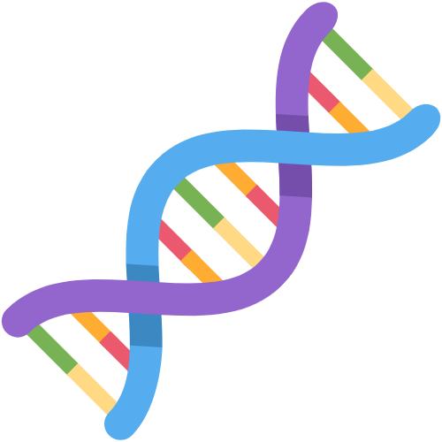

# Protein Matcher

<p align="center">
  
</p>


Demo web app to match a strand of DNA to a protein that it helps encode.

## See it live

[protein-matcher.talktosimon.com](https://protein-matcher.talktosimon.com)

## Local development

Tested on macOS only.

### 1. Install Docker.

Follow the instructions on the [Docker website](https://docs.docker.com/desktop/). Development on Protein Matcher requires the `docker` CLI.

### 2. Start the server.

```bash
git clone https://github.com/7imon7ays/protein-matcher
cd protein-matcher
make
```

This launches the containerized web app components: the database, web server, background worker, and frontend build server. They will claim ports 3000, 5432, and 8000. Make sure you don't have another process, such as another PostgreSQL server, listening on any of those.

The web server and background worker processes will fail betwen the time that the database is up and when it's ready to handle requests. This is expected.

After a few minutes, open your favorite browser and navigate to `localhost:3000` to start using the app.

See the Docker images used to set up this development environment [here](https://hub.docker.com/u/7imon7ays).

### 3. Run the test suite.

From the project root and with all the app components running in another tab.

```bash
make test
```

### 5. Run the linter.

Running the linter requires installing the project's dependencies locally.

```bash
pip install virtualenv
virtualenv env
. env/bin/activate
pip install -r requirements.txt
yarn install --cwd frontend
make lint
```


## How it works

### Protein matching

At its core Protein Matcher uses Biopython's Blast package to run a blast search against the servers of NCBI, National Center for Biotechnology Information, which expose various bioinformatics databases. It's straightforward except for one complication. The search is restricted to a list of proteins IDs<sup>1</sup>. Ideally this would be done with an Entrez query such as `NC_000852[accession] OR NC_007346[accession]`. But it seems none of the databases exposed by NCBI's servers match a DNA sequence to the protein IDs in the list. We need a workaround.

When we look up any of those IDs on [ncbi.nlm.nih.gov](https://www.ncbi.nlm.nih.gov/), we see a viral genome with a comment that points to another accession ID. E.g. for [NC_000852](https://www.ncbi.nlm.nih.gov/nuccore/NC_000852.5) the page reads "The reference sequence is identical to [JF411744](https://www.ncbi.nlm.nih.gov/nuccore/JF411744)". If we use that accession string, the blast search does find the expected result. So we map each of the original protein IDs to the corresponding accession strings that NCBI points to, use the latter in the search filter, and plug the result back into the original mapping to produce the expected protein ID.

See [matcher/management/commands/accn_ids.py](matcher/management/commands/map_accession_strings.py) for a script that calls NCBI and prints the mapping from accession string to protein ID.

<sup>1</sup>NC_000852, NC_007346, NC_008724, NC_009899, NC_014637, NC_020104, NC_023423, NC_023640, NC_023719, NC_027867

### User sessions

Users do not log in. For now every new visitor is simply assigned a cookie so that their recent searches are preserved while they navigate.

### Handling search failures

Protein Matcher uses [Django Background Tasks](https://django-background-tasks.readthedocs.io/) to search for matches in the background without blocking the user. When a search fails it's retried a certain number of times before it fails permanently. For now users have no way of knowing if a search is very slow or being retried many times or has permanently failed.

To check whether a search has failed permanently, the maintainer has to look up its corresponding background task.


## Browser support

The web client was tested on macOS Chrome, macOS Firefox, macOS Safari, iOS Chrome, and iOS Safari.

### Known compatibility issues

- The overflow property behaves differently in Firefox.
- iOS Safari does not display the keyboard when the page loads in spite of the text field's `autofocus` property.


## Other possible improvements

- File uploading could be more intuitive. It's not immediately obvious that the user has to click the search button once they've selected a file.
- Add unit tests, especially for server code.
- Support FASTA format in file upload.
- Report to the user when a search has failed too many times and will no longer be retried.
- Validate the user's input both client- and server-side. DNA sequences should have a minimum length and only consist of As, Gs, Cs, and Ts. The app could also reject DNA sequences that contain the right characters but no known codons before sending a request to the NCBI servers.
- Cache previously matched sequences in Redis to further reduce API calls. Sequences can be cached across users.
- Allow users to log in and out.
- Rate limit users so that they don't abuse the NCBI servers.
- Add automation to ensure periodically that the mapping from accession strings to protein IDs is up to date.
